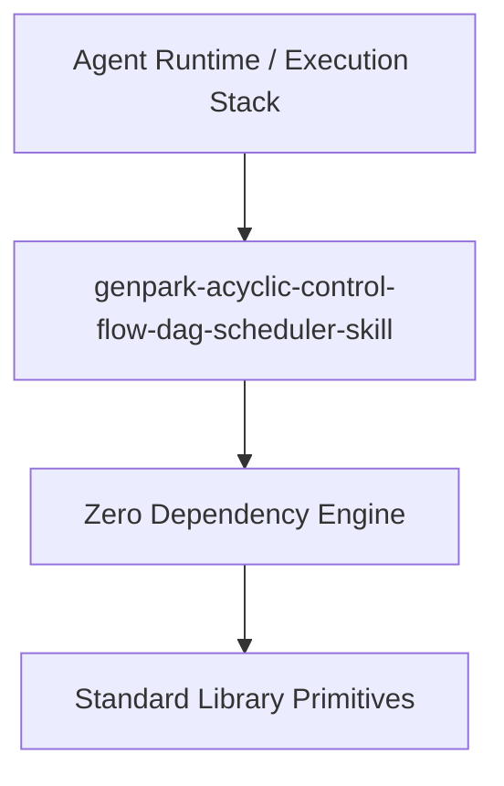

# genpark-acyclic-control-flow-dag-scheduler-skill

[](https://github.com/alphaparkinc/genpark-acyclic-control-flow-dag-scheduler-skill)
[](https://github.com/alphaparkinc/genpark-acyclic-control-flow-dag-scheduler-skill)
[](https://www.python.org/)

Acyclic instruction list scheduler ordering basic block dependence graphs by critical path latency to eliminate pipeline stalls.



## Features
- **Strict 0 Pip Dependencies**: Built completely using the Python Standard Library.
- **Fast Execution & Verification**: Includes client wrapper, MCP server, and verified test suites.
- **Agentic AI Ready**: Exposes standard MCP tools for continuous LLM integration.

## Installation & Quickstart
```bash
git clone https://github.com/alphaparkinc/genpark-acyclic-control-flow-dag-scheduler-skill.git
cd genpark-acyclic-control-flow-dag-scheduler-skill
python example_usage.py
```
